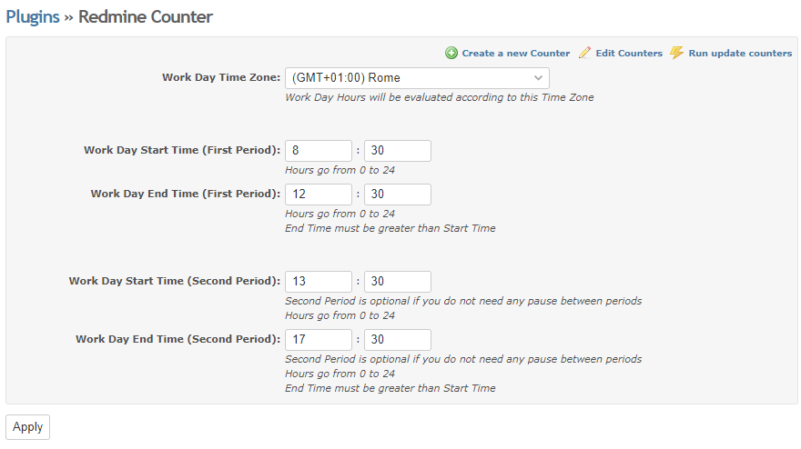
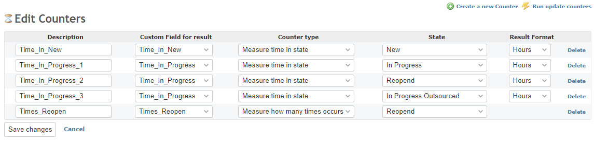
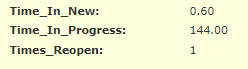

# Red Counter

Red Counter is a [Redmine](https://redmine.org) plugin for setting up issue-related counters.

Counters may be:
- Time spent in a particular state (summing time from different states is also supported)
- Counting occurrences of a state (e.g. how many times the issue has been reopened)

Time spent counters are evaluated according to working hours.  
Users can configure working hours according to their own needs.

Red Counter can be enabled at project level.

# Configuring Counters

Counters are configured from Administration -> Red Counter -> "Create a new counter".

A counter is defined below:

- Name/Description
- Custom Field where to save the counter result (must be int or float)
- Counter Type (Measure time spent / Measure occurrences)
- Issue state that must be observed
- Counter format (hours/minutes/seconds)

Some examples:

if you want to count the time an issue has not been taken over you have to:

1. Create a custom field (e.g. "Time_In_New", float)
1. Create a counter that saves the result in that "Time_In_New" custom field and observe "New" state

if you want to count how many times the issue has been reopened:

1. Create a custom field (e.g. "Times_Reopened", int)
1. Create a counter that saves the result in that "Times_Reopened" custom field and observe "Reopened" state

## Summing time from different states

Summing time from different states is also supported.

User simply has to define multiple counters, all writing to the same custom field.

For example, if user needs to count time spent when the issue is both Assigned and Reopened he/she can:

1. Create a custom field (e.g. "Time_In_Progress", float)
1. Create a counter that saves the result in that "Time_In_Progress" custom field and observe "Assigned" state
1. Create a counter that saves the result in the same "Time_In_Progress" custom field and observe "Reopened" state

# Configuring Working Hours

Time-spent counters are evaluated according to workind days and working hours.

Workind days are configured directly from Redmine Administration -> Settings -> Issue Trackingg -> "Non-working days".

Working hours are configured from plugin configuration page (Administration -> Plugins -> Red Counter -> Configure).

User must specify a Timezone and up to two working hours periods.

Default working hours periods are: 8:30-12:30 and 13:30-17:30.  
In the default case, for every working day only 8 hours are considered for evaluating counters.  
Everything occurring outside working hours is ignored.

If users need all day counters, he/she can simply configure period-1 from 00:00 to 24:00 and remove period-2.

# Triggering counters evaluation

Counter evaluation can be triggered in these ways:

- From plugin configuration page.  
A job is queued for processing counters evaluation

- From counters configuration page.  
A job is queued for processing counters evaluation
- By running a rake task (manually on in a cron)  
  
  `RAILS_ENV=production bundle exec rake red_counter:eval_time_spent`
  
Rake task also accepts two env variables (can also be provided together):

- ISSUES: a comma-separed list of issue ids.  
  If specified, only counters for that issues are evaluated and updated.  
  Usefull especially for troubleshooting single cases.

  `RAILS_ENV=production ISSUES=1,2 bundle exec rake red_counter:eval_time_spent`

- PROJECTS: a comma-separed list of projects ids.  
  If specified, only counters for issues in that projects are evaluated and updated  
  Usefull for updating different projects with different frequency intervals.

  `RAILS_ENV=production PROJECTS=1,2 bundle exec rake red_counter:eval_time_spent`

# Configuration example

In the following example we configure 3 counters:

- One counter measures how long a ticket stays in the "New" state
- One counter sums up how long a ticket stays in the "In Progress", "Reopend" and "In Progress Outsourced" states
- One counter counts how many times a ticket has been Reopened

On the issue, the result is the following:

